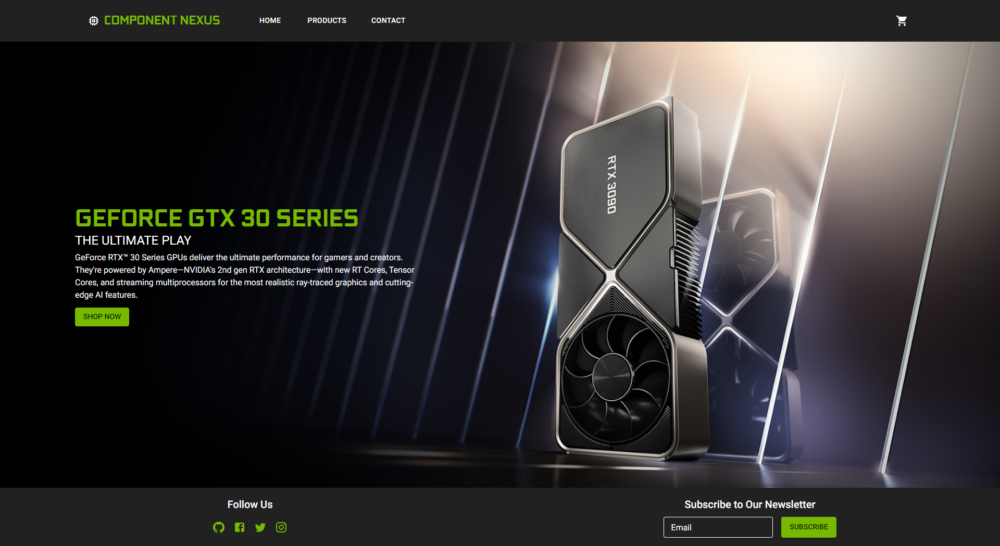
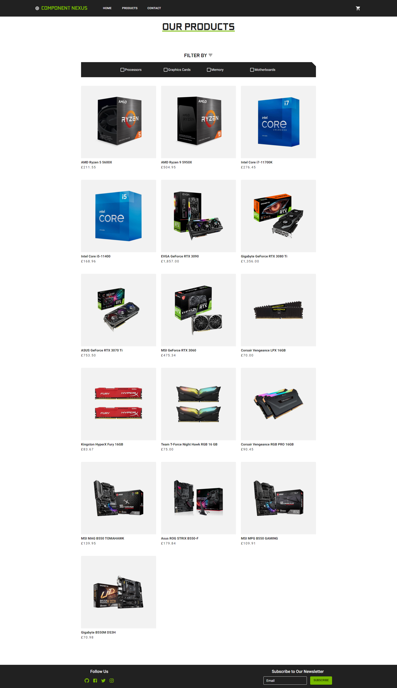
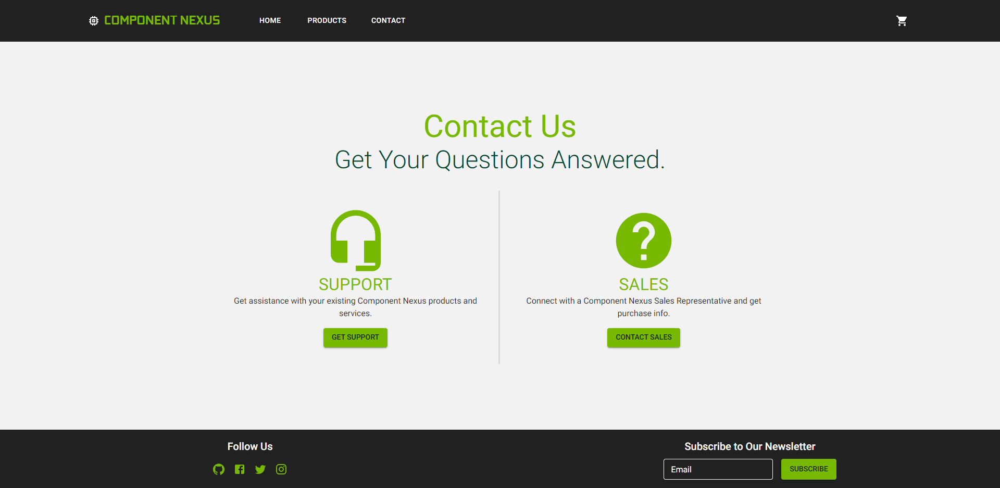
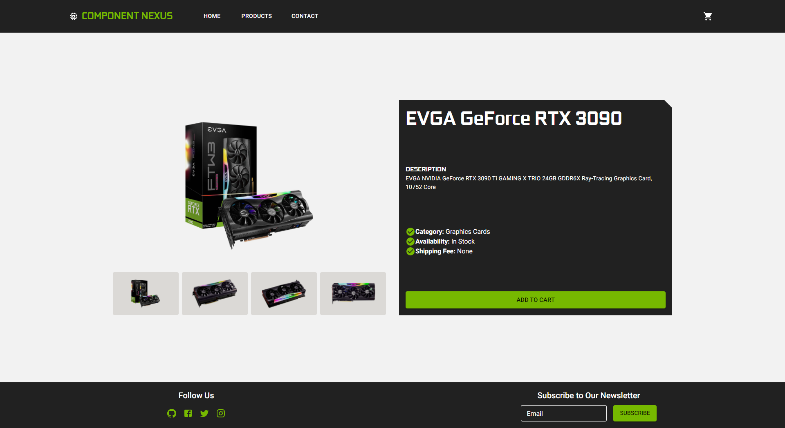
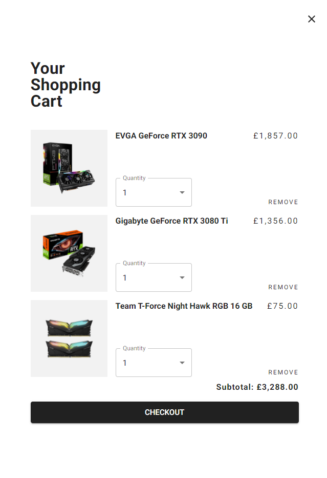

## Component Nexus
A shopping cart application.

- Live Demo: https://aidenm99.github.io/Component-Nexus/

## Technologies Used
This project was built using:
- HTML5
- CSS3
- JavaScript
- React
- React Router
- Material UI
- Webpack

## Features
- Switch between 'Home', 'Products' and 'Contact' pages with the help of React Router
- Each product comes with a series of related images the user can flick through
- Browse an array of products, click on one to view more details
- Add or remove items as needed from the shopping cart
- Change the quantity of an item in the shopping cart
- Utilises Material UI for a seamless experience
- Works on mobile devices

## Challenges
This application uses React Router to allow for routing between pages. This library was completely new to me at the time of building the application and as such, the initial
configuration was slightly confusing. More specifically, creating a route where I did not yet know the details of said route i.e. when a product is clicked on the product
page, was the most challenging aspect of using React Router in this application.

Additionally, this application was built and styled entirely using Material UI, a framework which was also completely new to me. Becoming familiar with MUI was by far 
the hardest part of building this application. In particular, utilising theming in MUI was a noteworthy challenge. However, I'm glad that I took the time to make use
of MUI in a project as I am now aware of how powerful this framework is for creating appealing user inferfaces, and I now have a much better understanding of it for the
future.

## Screenshots
Home Page

Products Page

Contact Page

Item Page

Shopping Cart

